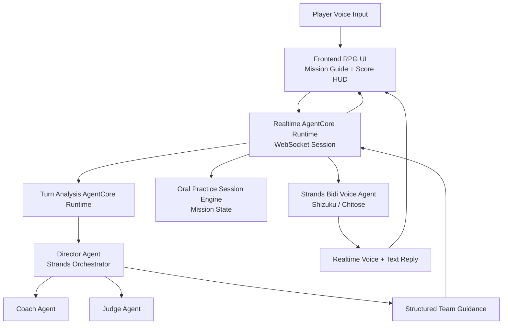
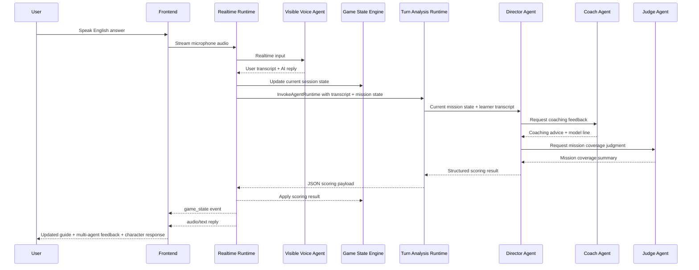

# Amazon Nova Sonic Oral Practice Game

An independent, conversational AI experience powered by **Amazon Nova 2 Sonic**.
This project features high-fidelity Live2D avatars in a cozy anime cafe environment for oral English practice.

## TL;DR

- A **dating-sim-style speaking game** with Shizuku and Chitose as voice companions.
- Uses **Amazon Nova 2 Sonic** for realtime voice play and a separate hidden runtime for turn analysis.
- The player clears staged scenes by speaking naturally, keeping the conversation romantic, fluent, and on-topic.

## Features
- **Nova 2 Sonic Integration**: Real-time voice interaction with ultra-low latency.
- **Target Language Selector**: Switch the learning language for the speaking mission using Nova Sonic 2 supported languages.
- **Oral Practice Missions**: Clear staged speaking goals with AI-generated score feedback, mission progression, and win/lose states.
- **Route-Based Live2D Character View**: The game shows either Shizuku or Chitose for a one-on-one scene, with Shizuku as the default route.
- **Cozy RPG UI**: A beautiful, glassmorphic anime cafe interface for immersive English roleplay.
- **Independent Deployment**: Fully self-contained AWS CDK infrastructure.

## Getting Started

### Prerequisites
- AWS Account with Bedrock Nova 2 Sonic access.
- Node.js & NPM (for CDK).
- Python 3.12+ (for local backend testing).

### Deployment
Run the included deployment script:
```bash
./deploy.sh
```

### Create a Web User
After deployment, create a Cognito user for the login page:
```bash
python scripts/create_web_user.py \
  --email you@example.com \
  --password 'ChooseAStrongPassword123!'
```

The script reads the user pool ID from `cdk/output.json` by default, so it works right after `./deploy.sh`.

## How to Play

The game is a **voice-guided oral English practice adventure**. You do not need to guess the rules anymore: the game screen now shows the **current mission**, **sample answer**, and **success checklist** for each stage.

### Basic Flow
1. Log in and open the game page.
2. Click **Start Practice**.
3. Listen to Shizuku or Chitose.
4. Reply in English using the mission guide on screen.
5. Click **Stop Practice** after your answer if you want the system to score that turn immediately.
6. Read the **Coach Feedback** panel and try again until you clear the stage.

### Win Condition
You win by clearing all 4 speaking missions before the turn limit runs out.

### Supported Target Languages (Amazon Nova 2 Sonic)
Based on the current AWS Nova Sonic 2 docs, the supported spoken languages in this app are:

| Language | Code | Notes |
|---|---|---|
| English (US) | `en-US` | Tiffany and Matthew are multilingual voices |
| English (UK) | `en-GB` | |
| English (Australia) | `en-AU` | |
| English / Hindi (India) | `en-IN`, `hi-IN` | Kiara and Arjun are region voices |
| French | `fr-FR` | |
| Italian | `it-IT` | |
| German | `de-DE` | |
| Spanish (US) | `es-US` | |
| Portuguese (Brazil) | `pt-BR` | |

For best multilingual behavior, the UI still recommends **Tiffany** for every supported target language because `language_support.py` currently returns `tiffany` as the recommended voice across the board. The actual route defaults are separate: **Shizuku** uses `tiffany`, **Chitose** uses `matthew`, and Shizuku is the default route unless `voice_id` is set to another supported route voice.

### The 4 Missions
| Stage | Goal | What to say |
|---|---|---|
| 1 | Introduce yourself | Name + school/city + hobby |
| 2 | Ask questions | At least two natural questions |
| 3 | Make a plan | Suggest an activity + time/day |
| 4 | Solve a misunderstanding | Be polite + give a reason + suggest a solution |

### Sample Playthrough
Use this as a beginner script when you first try the game:

1. **Stage 1**: "Hi, my name is Cyrus. I study at HKIIT in Hong Kong, and I enjoy listening to music after class."
2. **Stage 2**: "What do you like to do after school? How do you usually practice English?"
3. **Stage 3**: "Would you like to get coffee with me tomorrow after class? I think it would be fun to talk more at the cafe."
4. **Stage 4**: "I think we had a misunderstanding because I was nervous. Can we talk again and make a better plan together?"

## AI Agent Design Logic

The deployment now follows a split-runtime layout that is closer to AWS best practice for mixed-latency workloads:

1. **Visible Realtime Voice Agent** — the BidiAgent that speaks as the currently selected route character
2. **Realtime AgentCore Runtime** — hosts the websocket voice session and game-state loop
3. **Turn Analysis AgentCore Runtime** — isolates the slower Director/Judge/Coach scoring call
4. **Coach Agent** — gives short learning advice and a model line
5. **Judge Agent** — checks mission coverage and what is still missing
6. **Director Agent** — orchestrates the coach and judge as Strands tools, then decides the next scene beat and what the visible agent should do next
7. **Oral Practice Session Engine** — stores mission state, AI scoring results, and turn limits

The hidden multi-agent team now defaults to **Amazon Nova 2 Lite** through the inference profile ID `us.amazon.nova-2-lite-v1:0`. You can override it with `MULTI_AGENT_MODEL_ID` if you want to test another Bedrock model or profile.

The browser still connects only to the realtime runtime. That runtime then invokes the internal turn-analysis runtime over the AgentCore `InvokeAgentRuntime` API, which keeps the latency-sensitive audio path separate from heavier scoring/orchestration work.

### Why the App Uses Split Runtimes

The system intentionally separates **realtime speaking** from **turn analysis**:

1. **Realtime Runtime**
   - owns the websocket session
   - receives microphone audio
   - runs the visible Strands `BidiAgent`
   - maintains the active `PracticeSession`
   - sends `game_state` updates back to the browser
2. **Turn Analysis Runtime**
   - receives one scored turn at a time
   - runs the hidden Director / Coach / Judge team
   - returns structured JSON only
3. **Why this is better**
   - the voice path stays low-latency
   - analysis can be slower without blocking the audio stream
   - permissions are cleaner because the voice runtime and analysis runtime do different jobs
   - each runtime can evolve independently

### Design Roles
| Component | Responsibility |
|---|---|
| Frontend Voice Game UI | Captures microphone audio, shows mission guide, score, and coach feedback |
| Realtime AgentCore Runtime | Hosts the realtime session securely with WebSocket streaming |
| Turn Analysis AgentCore Runtime | Runs Director/Judge/Coach scoring behind the voice runtime |
| Strands Bidi Voice Agent | Talks as the selected route character and keeps the conversation immersive |
| Coach Agent | Produces short improvement advice and one model sentence |
| Judge Agent | Evaluates whether the learner covered the mission objective |
| Director Agent | Orchestrates the coach and judge, then sets the next scene beat and assistant goal |
| Oral Practice Session Engine | Tracks stages, turns, AI scoring, mission progression, and win/lose state |
| Mission Guide Layer | Provides step-by-step hints, sample answers, and success checklist for the current mission |

### Runtime Logic
1. The player speaks.
2. The frontend streams audio to the realtime AgentCore Runtime.
3. The Strands Bidi agent produces transcript + voice response.
4. The realtime runtime invokes the turn-analysis AgentCore Runtime for scoring.
5. The **Director Agent** runs there as a Strands orchestrator and calls the **Coach Agent** and **Judge Agent** as tools.
6. The Director returns structured guidance: coaching note, judge summary, next scene brief, and next assistant goal.
7. The realtime runtime updates the mission state and sends `game_state` back to the browser.
8. The frontend refreshes the mission guide, score panel, and **Multi-Agent Team** panel.
9. The visible voice agent continues the roleplay using the updated mission state plus the director guidance.

### Detailed Request Lifecycle

1. **Session start**
   - the browser opens a signed websocket to the realtime runtime
   - the player may set `voice_id`, selected character route, and target language
   - the realtime runtime creates a fresh `PracticeSession`
2. **Visible conversation**
   - the visible `BidiAgent` talks as Shizuku or Chitose
   - its system prompt is rebuilt from the latest mission state, coaching state, and target language
3. **Transcript capture**
   - user transcript chunks are merged into one complete answer for the turn
   - scoring only runs when a user turn is complete, not on every partial chunk
4. **Analysis call**
   - the realtime runtime sends mission context, transcript, current score, stage, route, and language to the turn-analysis runtime
   - the analysis runtime runs `analyze_turn(...)`
5. **Multi-agent orchestration**
   - the Director agent must call both the Coach and Judge tools
   - the Director returns one strict JSON object with scores, completion status, missing items, and next-scene guidance
6. **Game-state update**
   - the realtime runtime applies the structured result to `PracticeSession`
   - the UI receives updated score, mission, feedback, and agent-team insights
7. **Next reply**
   - the visible voice agent uses the updated prompt block
   - this lets the next spoken reply reflect the latest mission status and coaching direction

### Agent Responsibilities by Feature

| Feature | Primary owner | Supporting parts | Working logic |
|---|---|---|---|
| Realtime voice reply | Visible `BidiAgent` | Realtime runtime, `PracticeSession` prompt block | The visible agent handles the live back-and-forth voice session and responds in character using the latest mission and coaching context. |
| Coaching feedback | Coach Agent | Director Agent | The Coach produces a short, actionable improvement note and one model example sentence for the learner's next try. |
| Mission coverage judgment | Judge Agent | Director Agent | The Judge checks whether the learner covered the mission objective and highlights what is still missing. |
| Final scoring decision | Director Agent | Coach + Judge | The Director is the only hidden agent allowed to return the structured result used by the game. It merges tool outputs into JSON fields such as `mission_completed`, score values, and scene guidance. |
| Stage progression | `PracticeSession` | Director result | A stage clears only when `mission_completed` is true **and** the weighted overall score meets that mission's passing score. |
| Mission hints and sample answer | `PracticeSession` | `MISSIONS`, `language_support.py` | The backend sends `howToPlay`, `successSignals`, passing score, and a localized sample answer for the current mission. |
| Route / character behavior | Visible `BidiAgent` + Director | selected character state | The selected character list affects the speaking prompt for the visible agent and the route context given to the Director team. |
| Target language behavior | Visible `BidiAgent` | `language_support.py`, `PracticeSession` | The current target language is inserted into the system prompt so the visible agent mainly speaks in that language, and the sample answer is localized to match. |
| Score HUD | `PracticeSession` | Director result | The score panel is updated from the Director's numeric fields after backend weighting and clipping. |
| Multi-Agent Team panel | `PracticeSession.agent_team` | Director / Coach / Judge | The UI shows the latest coaching note, judge summary, scene brief, assistant goal, and next question returned from the hidden team. |
| Win / lose state | `PracticeSession` | mission rules, turn limit | The session becomes `won` after clearing all missions and `lost` when the player reaches the turn limit before clearing them all. |
| Failure handling | Realtime runtime | `PracticeSession` | If AI scoring fails, the answer is not scored, the turn count does not advance, and stage progression does not change. |

### Multi-Agent Working Logic for Each User-Facing Feature

#### 1. Realtime Conversation

- The player interacts only with the **visible** voice agent.
- That agent does **not** calculate the official score.
- Instead, it focuses on:
  - natural voice interaction
  - character personality
  - staying aligned with the current mission
  - using the latest Director guidance in the next reply

#### 2. Mission Guide

- The mission guide is not generated on the fly by the LLM.
- It comes from the backend `MISSIONS` definition:
  - objective
  - coach tip
  - how-to-play steps
  - success signals
  - passing score
- The only dynamic mission-guide part is the **sample answer**, which is localized using `language_support.py`.

#### 3. AI Score Breakdown

- The hidden Director returns five numeric fields:
  - `mission_coverage_score`
  - `fluency_score`
  - `vocabulary_score`
  - `grammar_score`
  - `confidence_score`
- The session engine then computes the displayed overall score with weighted logic:
  - Task Completion = **38%**
  - Fluency = **20%**
  - Vocabulary = **16%**
  - Grammar = **14%**
  - Confidence = **12%**
- All scores are clipped to `0-100`.

#### 4. Stage Clear Logic

- A stage does **not** clear on score alone.
- The backend requires both:
  - `mission_completed == true`
  - `overall_score >= mission.clear_score`
- Mission clear thresholds are currently:
  - Level 1: **72**
  - Level 2: **70**
  - Level 3: **74**
  - Final Level: **76**

#### 5. Coach Feedback Feature

- The Coach Agent specializes in **improvement advice**, not pass/fail decisions.
- Its output is used for:
  - `coach_feedback`
  - `coach_example`
  - part of the visible follow-up guidance for the next turn
- When a stage is not cleared, the backend uses the coach feedback inside `lastFeedback`.

#### 6. Judge Summary Feature

- The Judge Agent specializes in **coverage analysis**.
- It checks whether the learner actually included the required content for the mission.
- Its output is used for:
  - `judge_summary`
  - `missing_requirements`
  - part of the Director's decision on whether the mission is complete

#### 7. Director Scene Guidance Feature

- The Director Agent is the hidden orchestrator.
- It is responsible for:
  - calling both Coach and Judge tools
  - deciding whether the mission is complete
  - returning the official structured scores
  - generating:
    - `director_scene_brief`
    - `director_assistant_goal`
    - `director_next_question`
- These fields shape how the visible voice agent behaves on the next turn.

#### 8. Target Language Feature

- The target language affects both the **visible conversation** and the **learning guide**.
- Backend behavior:
  - `PracticeSession.target_language_code` stores the active language
  - `build_system_prompt_block()` tells the visible agent to speak mainly in that target language
  - `get_localized_sample_answer()` swaps the sample answer to the matching guide language
- The hidden scoring team also receives:
  - `target_language_code`
  - `target_language_label`
- This lets the hidden team judge the turn in the right learning context.

#### 9. Character Route Feature

- The app supports:
  - Shizuku route
  - Chitose route
- Route choice affects two places:
  - the visible agent prompt
  - the shared context passed to the Director team
- The hidden team sees the route name and can tailor the scene brief and next question to that route.

#### 10. Turn Limit / Win / Lose Feature

- The total turn budget is **16** for the whole run.
- On a successfully analyzed answer:
  - `turns_used` increments
  - `turns_remaining` updates
- If the player clears all missions, the game becomes `won`.
- If the player uses all turns before clearing all missions, the game becomes `lost`.

#### 11. Error / Fallback Feature

- If hidden-agent scoring fails:
  - the answer is preserved as `lastTranscript`
  - the score breakdown becomes unavailable
  - `overallScore` becomes `null`
  - the player is told scoring is temporarily unavailable
  - the stage does **not** advance
  - the turn counter does **not** advance
- This prevents fake progress or fake scores when the analysis path is unavailable.

### Source of Truth for Decisions

The app deliberately splits decision authority:

| Decision | Source of truth |
|---|---|
| What mission is active | `PracticeSession.stage_index` |
| What the player must do | `MISSIONS` |
| What language the app should teach in | `PracticeSession.target_language_code` |
| What sample answer to show | `language_support.py` |
| Whether the mission is complete | Director result + session clear rule |
| What score to display | Director numeric fields after backend weighting |
| What the next spoken roleplay beat should be | Director guidance fields |
| Whether the game is won or lost | `PracticeSession` |

### Security and Invocation Model

1. The browser can invoke only the **realtime** AgentCore runtime.
2. The browser does **not** call the hidden turn-analysis runtime directly.
3. The realtime runtime invokes the hidden runtime with `InvokeAgentRuntime`.
4. IAM permissions are split so:
   - end users call the public realtime runtime
   - the realtime runtime can call the hidden analysis runtime
   - the analysis runtime holds the hidden-model invocation permission

This keeps the multi-agent scoring path private and reduces coupling between the UI and the hidden orchestration layer.

### Architecture Diagram



### Conversation and Scoring Diagram



### Local Development
1. Start the local backend with the helper script:
   ```bash
   ./scripts/run_local.sh
   ```
2. The script will create `.venv`, activate it, and install backend dependencies if needed.
3. If you prefer to run the steps manually:
   ```bash
   python3 -m venv .venv
   source .venv/bin/activate
   pip install -r backend/requirements.txt
   python backend/dating_voice_agent.py
   ```
4. Local development keeps turn analysis in-process unless you set `TURN_ANALYSIS_RUNTIME_ARN`, so you can still run the app with a single local Python process.
5. Open `http://localhost:8080/` in your browser. The FastAPI app serves the frontend assets, `/login.html`, and the websocket endpoint from the same local process.

## License
MIT
