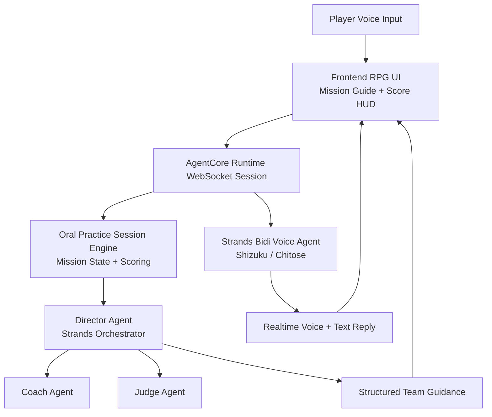
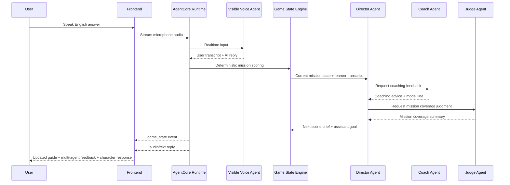

# Amazon Nova Sonic Oral Practice Game

An independent, conversational AI experience powered by **Amazon Nova 2 Sonic**.
This project features high-fidelity Live2D avatars in a cozy anime cafe environment for oral English practice.

## Features
- **Nova 2 Sonic Integration**: Real-time voice interaction with ultra-low latency.
- **Target Language Selector**: Switch the learning language for the speaking mission using Nova Sonic 2 supported languages.
- **Oral Practice Missions**: Clear staged speaking goals with score feedback, mission progression, and win/lose states.
- **Dual Live2D Characters**: Shizuku and Chitose respond with synchronized mouth movements and emotional expressions.
- **Cozy RPG UI**: A beautiful, glassmorphic anime cafe interface for immersive English roleplay.
- **Independent Deployment**: Fully self-contained AWS CDK infrastructure.

## Getting Started

### Prerequisites
- AWS Account with Bedrock Nova 2 Sonic access.
- Node.js & NPM (for CDK).
- Python 3.12+ (for local backend testing).

### Deployment
Run the included deployment script:
```bash
./deploy.sh
```

### Create a Web User
After deployment, create a Cognito user for the login page:
```bash
python scripts/create_web_user.py \
  --email you@example.com \
  --password 'ChooseAStrongPassword123!'
```

The script reads the user pool ID from `cdk/output.json` by default, so it works right after `./deploy.sh`.

## How to Play

The game is a **voice-guided oral English practice adventure**. You do not need to guess the rules anymore: the game screen now shows the **current mission**, **sample answer**, and **success checklist** for each stage.

### Basic Flow
1. Log in and open the game page.
2. Click **Start Practice**.
3. Listen to Shizuku or Chitose.
4. Reply in English using the mission guide on screen.
5. Click **Stop Practice** after your answer if you want the system to score that turn immediately.
6. Read the **Coach Feedback** panel and try again until you clear the stage.

### Win Condition
You win by clearing all 4 speaking missions before the turn limit runs out.

### Supported Target Languages (Amazon Nova 2 Sonic)
Based on the current AWS Nova Sonic 2 docs, the supported spoken languages in this app are:

| Language | Code | Notes |
|---|---|---|
| English (US) | `en-US` | Tiffany and Matthew are multilingual voices |
| English (UK) | `en-GB` | |
| English (Australia) | `en-AU` | |
| English / Hindi (India) | `en-IN`, `hi-IN` | Kiara and Arjun are region voices |
| French | `fr-FR` | |
| Italian | `it-IT` | |
| German | `de-DE` | |
| Spanish (US) | `es-US` | |
| Portuguese (Brazil) | `pt-BR` | |

For best multilingual behavior, the game currently recommends the **Tiffany** voice because AWS documents Tiffany and Matthew as polyglot voices across supported Nova Sonic languages.

### The 4 Missions
| Stage | Goal | What to say |
|---|---|---|
| 1 | Introduce yourself | Name + school/city + hobby |
| 2 | Ask questions | At least two natural questions |
| 3 | Make a plan | Suggest an activity + time/day |
| 4 | Solve a misunderstanding | Be polite + give a reason + suggest a solution |

### Sample Playthrough
Use this as a beginner script when you first try the game:

1. **Stage 1**: "Hi, my name is Cyrus. I study at VTC in Hong Kong, and I enjoy listening to music after class."
2. **Stage 2**: "What do you like to do after school? How do you usually practice English?"
3. **Stage 3**: "Let's get coffee tomorrow after class. We can practice English together at the cafe."
4. **Stage 4**: "I think we had a misunderstanding because I was nervous. Can we talk again and make a better plan together?"

## AI Agent Design Logic

The current runtime now uses a **real Strands multi-agent team**:

1. **Visible Realtime Voice Agent** — the BidiAgent that speaks as Shizuku/Chitose
2. **Coach Agent** — gives short learning advice and a model line
3. **Judge Agent** — checks mission coverage and what is still missing
4. **Director Agent** — orchestrates the coach and judge as Strands tools, then decides the next scene beat and what the visible agent should do next
5. **Oral Practice Session Engine** — stores the deterministic mission state, scores, and turn limits

The hidden multi-agent team defaults to **Amazon Nova Pro** with model ID `amazon.nova-pro-v1:0`. You can override it with `MULTI_AGENT_MODEL_ID` if you want to test another Bedrock model.

### Design Roles
| Component | Responsibility |
|---|---|
| Frontend Voice Game UI | Captures microphone audio, shows mission guide, score, and coach feedback |
| AgentCore Runtime | Hosts the realtime session securely with WebSocket streaming |
| Strands Bidi Voice Agent | Talks as Shizuku/Chitose and keeps the conversation immersive |
| Coach Agent | Produces short improvement advice and one model sentence |
| Judge Agent | Evaluates whether the learner covered the mission objective |
| Director Agent | Orchestrates the coach and judge, then sets the next scene beat and assistant goal |
| Oral Practice Session Engine | Tracks stages, turns, scoring, mission progression, and win/lose state |
| Mission Guide Layer | Provides step-by-step hints, sample answers, and success checklist for the current mission |

### Runtime Logic
1. The player speaks.
2. The frontend streams audio to AgentCore Runtime.
3. The Strands Bidi agent produces transcript + voice response.
4. The backend updates the deterministic mission score and stage state.
5. The **Director Agent** runs as a Strands orchestrator and calls the **Coach Agent** and **Judge Agent** as tools.
6. The Director returns structured guidance: coaching note, judge summary, next scene brief, and next assistant goal.
7. The frontend refreshes the mission guide, score panel, and **Multi-Agent Team** panel.
8. The visible voice agent continues the roleplay using the updated mission state plus the director guidance.

### Architecture Diagram



### Conversation and Scoring Diagram



### Local Development
1. Start the local backend with the helper script:
   ```bash
   ./scripts/run_local.sh
   ```
2. The script will create `.venv`, activate it, and install backend dependencies if needed.
3. If you prefer to run the steps manually:
   ```bash
   python3 -m venv .venv
   source .venv/bin/activate
   pip install -r backend/requirements.txt
   python backend/dating_voice_agent.py
   ```
4. Open `frontend/index.html` in your browser (use a local web server like Live Server).

## License
MIT
